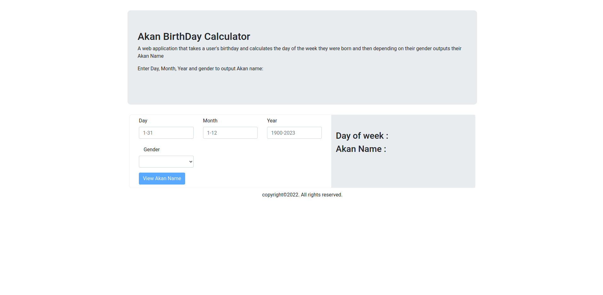

# Akan Birthday calculator
#### A fun web app that tells your Akan Name based on the day of week you were born. 
#### By **Evans Kiptarus Kibet**
*******
## Description
An Akan Name is a naming system used by people in Ghana where a child is named based on the day of the week they were born. This simple web app, calculates the day of the week which you were born based on your inputs and assigns you an Akan Name.
## Setup/Installation Requirements
* clone the repository to your local computer
* Open the project folder 
* (Optional) Open in a text editor (preffered Visual studio code or Atom)       Download a Live-server package on the editor and run the project.         (Default port is 5500)

* Use updated browsers. Google chrome and Firefox are preferred. Code uses ES6 syntax.

## Project Structure
 * css folder - Contain the project stylesheet files
 * js folder - contain the javascript files and function
 * index.html file - main project entry page

## Technologies Used
 * HTML
 * CSS
 * JavaScript
 * Jquery
 * Google Fonts

 ## 📷 Previews

### License
NO license

Copyright (c) {2024} **{Evans Kiptarus Kibet}**
  